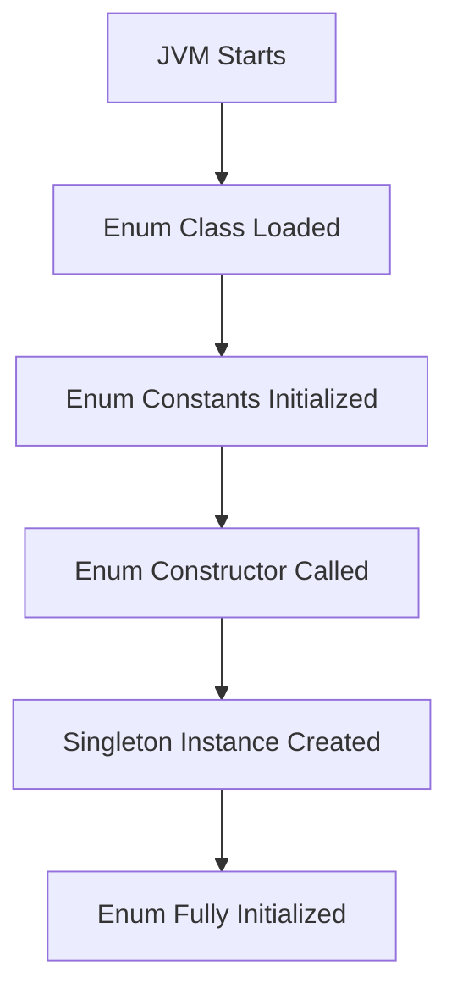

Enums (short for enumerations) are a special type of class in Java used to define collections of constants. They provide a way to represent a fixed set of values, which can be useful for modeling things like days of the week, playing card suits, or status codes.

Let's break down the key aspects of enum classes in Java:

1. Basic Declaration:

```java
public enum Day {
    MONDAY, TUESDAY, WEDNESDAY, THURSDAY, FRIDAY, SATURDAY, SUNDAY
}

```

2. Key Features:

   a. Type-Safe: Enums are type-safe, meaning you can't assign values that aren't defined in the enum.
   
   b. Comparable: Enum constants are automatically Comparable.
   
   c. Serializable: Enums implement java.io.Serializable interface.

3. Methods and Fields:
   Enums can have fields, constructors, and methods.

```java
public enum Planet {
    MERCURY(3.303e+23, 2.4397e6),
    VENUS  (4.869e+24, 6.0518e6),
    EARTH  (5.976e+24, 6.37814e6);

    private final double mass;   // in kilograms
    private final double radius; // in meters
    
    Planet(double mass, double radius) {
        this.mass = mass;
        this.radius = radius;
    }
    
    public double surfaceGravity() {
        double G = 6.67300E-11;
        return G * mass / (radius * radius);
    }
}

```

4. Useful Methods:
   Java provides some built-in methods for all enums:

   - `values()`: Returns an array of all enum constants.
   - `valueOf(String name)`: Returns the enum constant with the specified name.
   - `ordinal()`: Returns the position of the enum constant (0-based).
   - `name()`: Returns the name of the enum constant.

5. Enum in switch statements:
   Enums are often used in switch statements for clean, readable code.

```java
Day today = Day.MONDAY;
switch (today) {
    case MONDAY:
        System.out.println("Start of work week");
        break;
    case FRIDAY:
        System.out.html("TGIF!");
        break;
    case SATURDAY: case SUNDAY:
        System.out.println("Weekend!");
        break;
    default:
        System.out.println("Midweek");
}

```

6. Implementing Interfaces:
   Enums can implement interfaces, allowing for polymorphic behavior.

```java
public interface Descriptive {
    String getDescription();
}

public enum Season implements Descriptive {
    SPRING("Flowers bloom"),
    SUMMER("It's hot"),
    AUTUMN("Leaves fall"),
    WINTER("It's cold");

    private final String description;

    Season(String description) {
        this.description = description;
    }

    @Override
    public String getDescription() {
        return this.description;
    }
}

```

7. Enum Singleton:
   Enums provide a thread-safe way to implement the Singleton pattern.

```java
public enum DatabaseConnection {
    INSTANCE;
    
    private Connection connection;
    
    DatabaseConnection() {
        // Initialize the connection
    }
    
    public void connect() {
        // Connection logic
    }
}

// Usage
DatabaseConnection.INSTANCE.connect();

```

Key Points to Remember:
- Enum constructors are always private (explicitly or implicitly).
- Enums cannot be extended (inherited).
- The enum constants are defined at the beginning of the enum body.
- Enums can have abstract methods, but then every constant must implement them.

Enums in Java provide a powerful way to represent fixed sets of constants with additional benefits like type-safety, ability to add behavior, and built-in methods for comparison and iteration. They're widely used in Java programming for cleaner, more maintainable, and bug-resistant code.

##  Enum-based singletons are thread-safe
Excellent question! Enum-based singletons are indeed thread-safe, and understanding why requires diving into some Java language specifics and JVM behavior. Let's break this down:

1. Enum Initialization:



   - Enums are initialized when the enum class is first loaded and used.
   - This initialization is done by the JVM at class loading time, which is guaranteed to be thread-safe.

2. JVM Guarantees:
   - The Java Language Specification guarantees that enum initialization is thread-safe.
   - The JVM ensures that only one instance of each enum value is created, even in a multi-threaded environment.

3. Lazy Initialization:
   - Enum-based singletons are lazily initialized. The enum and its constants are not created until they are first referenced.

4. Serialization Safety:
   - Enums have built-in protection against multiple instantiation through serialization/deserialization.

5. Reflection-Proof:
   - Unlike traditional singleton patterns, enum-based singletons are protected against reflection attacks.

Let's look at an example to illustrate this:

```java
public enum EnumSingleton {
    INSTANCE;

    private final Connection connection;

    EnumSingleton() {
        connection = createConnection();
    }

    private Connection createConnection() {
        // Logic to create a database connection
        return new Connection(); // Simplified for example
    }

    public void executeQuery(String query) {
        // Use the connection to execute a query
        System.out.println("Executing query: " + query);
    }

    // Inner class to simulate a database connection
    private static class Connection {
        // Connection details
    }
}

// Usage
public class Main {
    public static void main(String[] args) {
        // Thread 1
        new Thread(() -> {
            EnumSingleton.INSTANCE.executeQuery("SELECT * FROM users");
        }).start();

        // Thread 2
        new Thread(() -> {
            EnumSingleton.INSTANCE.executeQuery("SELECT * FROM products");
        }).start();
    }
}

```

In this example:

1. `EnumSingleton.INSTANCE` is guaranteed to be created only once, even when accessed from multiple threads.
2. The constructor of `EnumSingleton` is called only once, ensuring that only one `Connection` object is created.
3. Multiple threads can safely use `EnumSingleton.INSTANCE` without any additional synchronization.

Key Advantages:

1. Simplicity: No need for complex double-checked locking or volatile fields.
2. Guaranteed Thread Safety: The JVM handles the thread-safety of enum initialization.
3. Serialization Safety: Enums handle serialization specially, preventing creation of multiple instances.
4. Reflection-Proof: Reflection can't be used to create additional instances of an enum.

Comparison with Traditional Singleton:

```java
public class TraditionalSingleton {
    private static TraditionalSingleton instance;
    
    private TraditionalSingleton() {}
    
    public static synchronized TraditionalSingleton getInstance() {
        if (instance == null) {
            instance = new TraditionalSingleton();
        }
        return instance;
    }
}
```

The traditional approach requires explicit synchronization and is vulnerable to reflection attacks and serialization issues.

In summary, enum-based singletons leverage the JVM's guarantees about enum initialization to provide a thread-safe, serialization-safe, and reflection-proof singleton implementation. This makes them an excellent choice for implementing the Singleton pattern in Java, especially when you need guaranteed thread safety without the complexity of other synchronization mechanisms.

Would you like me to elaborate on any specific aspect of this thread-safety or compare it with other singleton implementations?
