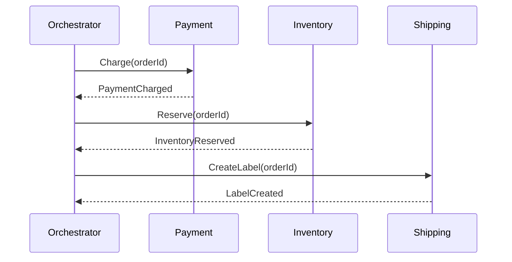
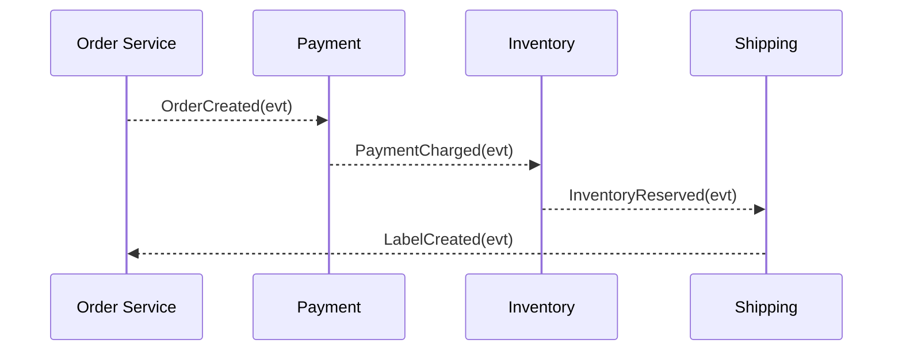

* **Orchestration = conductor during the performance.** A central brain (workflow/orchestrator) *actively directs each step at runtime* and handles retries/compensations.
* **Choreography = dancers follow choreography + cues, no conductor.** The “design” is the event contracts and reactions; at runtime, each service *reacts to events on its own*—the flow **emerges** without a central boss.

Two better analogies people use:

* **Traffic lights (orchestration)** vs **roundabout (choreography)**.
* **Conductor-led orchestra** vs **improv jazz ensemble with agreed cues**.

Caveat: in software, choreography isn’t “pre-baked then passive”—services still make live decisions based on events; it’s just **decentralized control**.

Here’s a crisp, practical breakdown.

## Tiny example (Order → Payment → Inventory → Shipping)

**Orchestration (central brain):**

**Choreography (event dance):**

## Pros & cons (at a glance)

| Aspect           | Orchestration                     | Choreography                     |
| ---------------- | --------------------------------- | -------------------------------- |
| Control flow     | Explicit, single place            | Implicit, spread across services |
| Changeability    | Easy to change flow logic         | Changes touch multiple services  |
| Observability    | Centralized tracing & metrics     | Needs strong distributed tracing |
| Failure handling | Coordinated retries/compensations | Each service handles its part    |
| Coupling         | Temporal coupling to orchestrator | Event contracts between peers    |
| Team autonomy    | Lower (central gatekeeper)        | Higher (local reactions)         |
| Risk             | “God service” anti-pattern        | “Event spaghetti” anti-pattern   |

## When to use which

Choose **orchestration** when:

* Flows are **complex or changing often** (A/B paths, human steps, SLAs).
* You need **deadlines, timeouts, compensation ordering**, and clear auditability.
* You want **one place** to model/monitor business processes.

Choose **choreography** when:

* Domain is **simple and stable**, with **few events** and clear boundaries.
* You value **team autonomy** and loose coupling.
* Latency and **local decisions** dominate (e.g., caches, projections, notifications).

## Industry tools & idioms

* **Orchestration engines:** Temporal, Camunda/Zeebe, Netflix Conductor, AWS Step Functions.
  Features: durable state, timers, retries/backoff, compensation, visibility.
* **Choreography stack:** Kafka/RabbitMQ + outbox/inbox pattern, idempotency keys, consumer dedup, schema registry for events.

## Sagas & compensations (fit either style)

* Orchestrated Sagas: the engine calls `Reserve → Charge → Ship`, and on failure runs **compensations in reverse**.
* Choreographed Sagas: each service emits failure events and other services **react** with their compensations (`RefundIssued`, `InventoryReleased`, …).

## Key design patterns (both styles)

* **Idempotency keys** on commands/events (avoid double-charge/ship).
* **Outbox/Inbox** (transactional messaging) to get reliable, exactly-once-ish processing on an at-least-once bus.
* **Time bounds & DLQs** for stuck instances.
* **Versioned event schemas** (back-compat by default).
* **Correlation IDs** for tracing a single business instance across services.

## Common mistakes

* **Orchestration:** bloated “God orchestrator”, mixing business logic with low-level integration; single point of failure without HA.
* **Choreography:** “event spaghetti” (unclear flow), accidental tight coupling via undocumented event contracts, unbounded retries without idempotency.

## A pragmatic hybrid (common in practice)

* Use **orchestration** for the *few* critical, cross-cutting workflows (payments, onboarding, fulfillment) where visibility/SLAs matter.
* Use **choreography** for *local, reactive* concerns (caching, read models, notifications).
* Keep **events as truth**; let the orchestrator issue **commands** and listen to **events**.

## Test & operate well

* **Contract tests** for events and commands.
* **Replay tests** (can you rebuild state from events?).
* **Chaos/resilience tests** (drop/duplicate messages, crash mid-saga).
* **Dashboards:** per-step latency, retry counts, compensation rates; alert on stuck states.

**Rule of thumb:**
If you need *clarity, control, and auditability* → start with **orchestration**.
If you need *autonomy and loose coupling* with simple interactions → go **choreography**.
Most mature systems end up **hybrid**, with Sagas, idempotency, and transactional messaging at the core.
