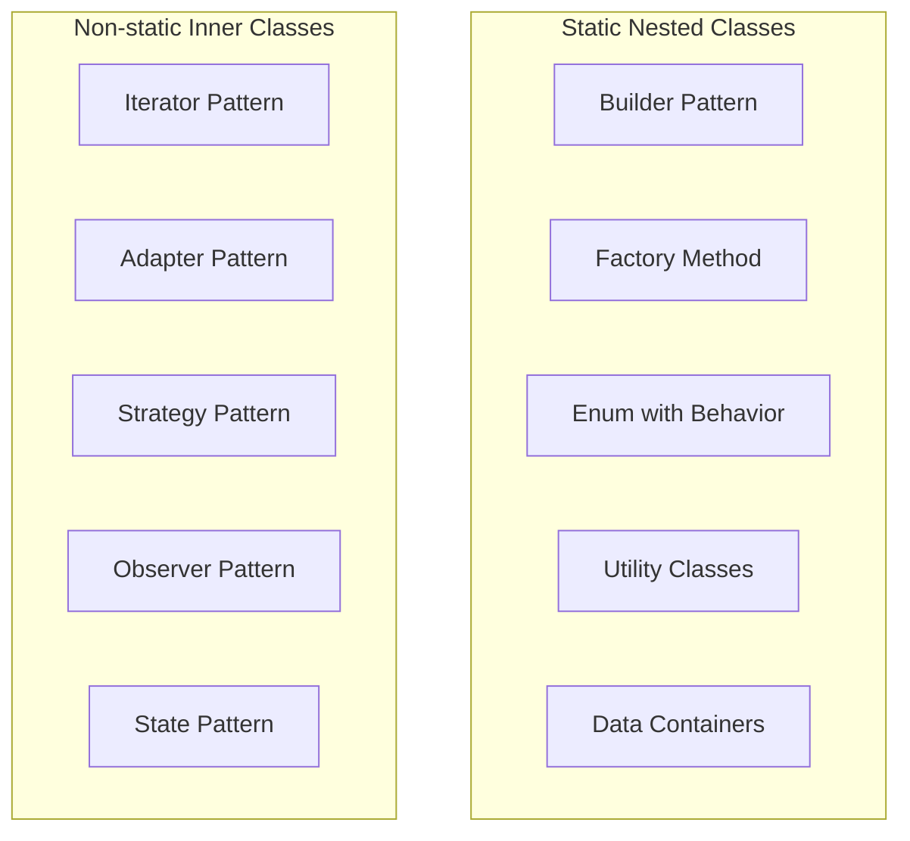

Static and non-static inner classes are used in various design patterns and use cases in Java. Let's explore some popular use case patterns for both:

1. Static Nested Classes:

   a. Builder Pattern:
      Often used for complex object creation.

```java
public class Pizza {
       private final int size;
       private final boolean cheese;
       private final boolean pepperoni;

       private Pizza(Builder builder) {
           this.size = builder.size;
           this.cheese = builder.cheese;
           this.pepperoni = builder.pepperoni;
       }

       public static class Builder {
           private int size;
           private boolean cheese;
           private boolean pepperoni;

           public Builder(int size) {
               this.size = size;
           }

           public Builder cheese(boolean value) {
               cheese = value;
               return this;
           }

           public Builder pepperoni(boolean value) {
               pepperoni = value;
               return this;
           }

           public Pizza build() {
               return new Pizza(this);
           }
       }
   }

   // Usage
   Pizza pizza = new Pizza.Builder(12)
                   .cheese(true)
                   .pepperoni(true)
                   .build();
   
```

   b. Factory Method Pattern:
      Used for creating instances of a class.

   c. Enum with Behavior:
      When you need to associate behavior with enum constants.

   d. Utility Classes:
      Grouping related utility methods.

   e. Data Container Classes:
      For holding related data structures.

2. Non-static Inner Classes:

   a. Iterator Pattern:
      Commonly used in collection classes to provide iteration.

 ```java
public class CustomList<E> implements Iterable<E> {
       private E[] elements;
       private int size;

       // Constructor and other methods...

       @Override
       public Iterator<E> iterator() {
           return new ListIterator();
       }

       private class ListIterator implements Iterator<E> {
           private int currentIndex = 0;

           @Override
           public boolean hasNext() {
               return currentIndex < size;
           }

           @Override
           public E next() {
               if (!hasNext()) {
                   throw new NoSuchElementException();
               }
               return elements[currentIndex++];
           }
       }
   }

   // Usage
   CustomList<String> list = new CustomList<>();
   for (String item : list) {
       System.out.println(item);
   }
   
```

   b. Adapter Pattern:
      For adapting an existing class to a different interface.

   c. Strategy Pattern:
      Defining a family of algorithms.

   d. Observer Pattern:
      Implementing event listeners.

   e. State Pattern:
      Representing different states of an object.

3. Comparison of Use Cases:

   



4. Additional Use Cases:

   a. Static Nested Classes:
      - Caching: Implementing caching mechanisms.
      - Singleton: Implementing thread-safe singleton pattern.
      - Constants: Grouping related constants.

   b. Non-static Inner Classes:
      - UI Components: Implementing custom UI components in frameworks like Swing or JavaFX.
      - Callbacks: Implementing callback interfaces.
      - Domain-Specific Language (DSL): Creating fluent interfaces.

5. Best Practices in Usage:

   - Prefer static nested classes unless you need access to the outer class instance.
   - Use non-static inner classes when the nested class needs to manipulate the state of the outer class.
   - Consider anonymous inner classes for short, one-time use implementations (e.g., event handlers, comparators).
   - Be cautious of potential memory leaks with non-static inner classes, especially in long-lived objects.

6. Framework-Specific Uses:

   - In Android development, non-static inner classes are often used for event handlers and AsyncTask implementations.
   - In Java EE, static nested classes are commonly used for defining named queries in JPA entities.

Here's an example of using a non-static inner class for a custom comparator:

```java
public class Person {
    private String name;
    private int age;

    // Constructor, getters, setters...

    public class AgeComparator implements Comparator<Person> {
        @Override
        public int compare(Person p1, Person p2) {
            return Integer.compare(p1.age, p2.age);
        }
    }

    // Usage
    public static void main(String[] args) {
        List<Person> people = // ... initialize list
        Person person = new Person();
        Collections.sort(people, person.new AgeComparator());
    }
}

```

In this example, the `AgeComparator` is a non-static inner class because it might need access to instance members of the `Person` class (though in this simple case, it doesn't).

Understanding these patterns and use cases helps in making informed decisions about when and how to use static and non-static inner classes in Java, leading to more organized, efficient, and maintainable code.
