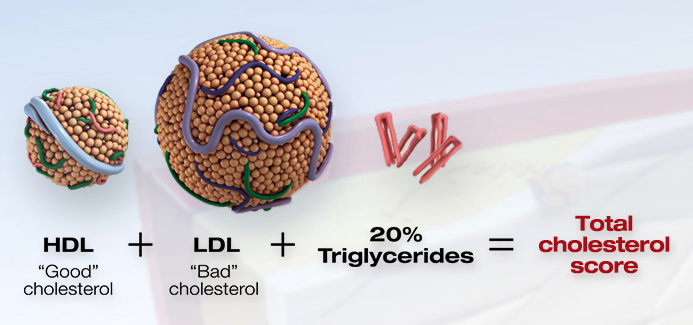

cholesterol can join with fats and other substances to build up in the inner walls of your arteries. The arteries can become clogged and narrow, and blood flow is reduced.  

https://watchlearnlive.heart.org/index.php?moduleSelect=chlscr

### LDL 
Low-density lipoprotein (LDL or 'bad') cholesterol can join with fats and other substances to build up in the inner walls of your arteries.   

### HDL
High-density lipoprotein (HDL or 'good') carries harmful cholesterol away from the arteries and helps protect you from heart attack and stroke.

### Triglycerides
Triglycerides are a type of fat that is packaged with cholesterol when the lipoproteins form in the liver cells. Triglycerides are stored in fat all over the body and can be an energy source, like carbohydrates. Your cholesterol scores will show a measurement for triglycerides. A score higher than normal may mean you have a higher chance of developing coronary artery disease.

