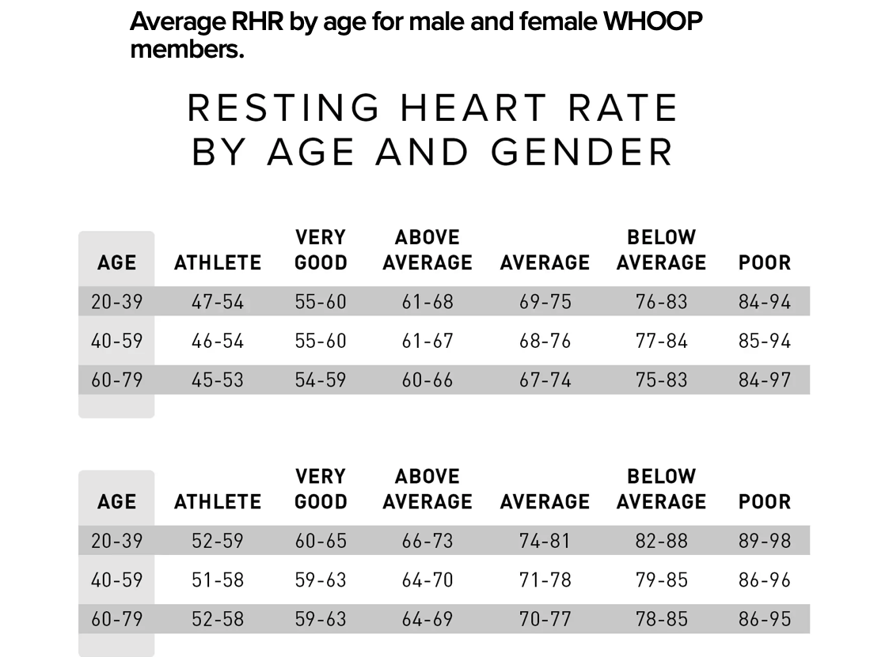

Resting Heart Rate

Generally speaking, when your heart rate decreases, it means that each beat is more effective. A low RHR is a sign of a strong heart muscle that can pump enough blood to supply the body with oxygen without having to labor too hard. When your heart doesn’t need to work as hard to push blood through your body to supply oxygen to your muscles, your level of fitness increases.  

https://www.whoop.com/us/en/thelocker/resting-heart-rate-by-age-and-gender/

