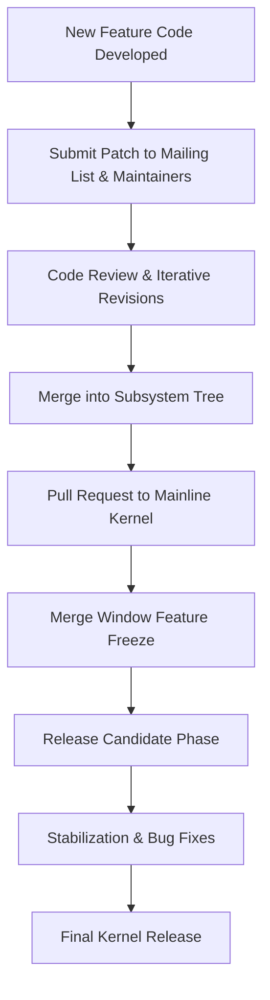

>> The kernel evolves based on the merit of the code and the feedback it receives rather than the adherence to a formal written plan. People submit patches. The patch gets reviewed and discussed and edited and then commited
>> The code, along with detailed commit messages and inline comments, often serves as the de facto specification for how a feature works.


Below is a simplified, hypothetical example inspired by real Linux kernel practices. In this example, a patch adds a "lazy inode initialization" feature to a file system. The commit message explains the rationale, design decisions, and testing results, while the inline comments in the code provide a step-by-step explanation of how the feature works.

---

### **Example Commit Message**

```
commit abcdef1234567890
Author: Jane Developer <jane@example.com>
Date:   2025-02-16

    [PATCH] ext4: Add lazy inode initialization to improve mount performance

    This patch introduces a lazy initialization mechanism for inodes in the ext4
    filesystem. Instead of fully initializing all inodes at mount time, the new
    approach defers complete initialization until the inode is actually accessed.
    
    Key benefits:
    - Reduces mount time for filesystems with a large number of inodes.
    - Spreads the initialization cost over time as inodes are needed.
    
    The implementation adds a new function, lazy_init_inode(), which checks if
    an inode has been initialized and, if not, performs the required setup. Detailed
    inline comments in the code below explain each step of the process.
    
    Tested on a system with over 100K inodes, showing a mount time improvement of ~12%.

    Reviewed-by: Alex Maintainer <alex@example.com>
```

---

### **Example Code Snippet with Inline Comments**

```c
/**
 * lazy_init_inode - Lazily initialize an inode when first accessed.
 * @inode: Pointer to the inode to initialize.
 *
 * This function defers the full initialization of an inode until it is first
 * accessed, which can significantly reduce mount times for filesystems with
 * a very high number of inodes.
 *
 * Return: 0 on success, or a negative error code on failure.
 */
int lazy_init_inode(struct inode *inode)
{
    // Validate the inode pointer.
    if (!inode) {
        return -EINVAL;
    }

    /* 
     * Check if the inode is already initialized.
     * The 'initialized' flag is part of the inode structure and is set to 0 by default.
     */
    if (inode->initialized) {
        return 0;  // Already initialized, nothing to do.
    }

    /*
     * Allocate memory for the inode's extended data structure.
     * This allocation is deferred until necessary to save resources at mount time.
     */
    inode->data = kmalloc(sizeof(struct inode_data), GFP_KERNEL);
    if (!inode->data) {
        return -ENOMEM;  // Memory allocation failed.
    }

    /*
     * Perform additional initialization steps as required.
     * For example, setting up default permissions, timestamps, or other metadata.
     */
    // initialize_default_permissions(inode);
    // setup_inode_timestamps(inode);

    // Mark the inode as initialized to avoid redoing work on subsequent accesses.
    inode->initialized = 1;

    return 0;  // Initialization successful.
}
```

---

### **Explanation**

- **Commit Message as Specification:**  
  The commit message explains the *why* (improve mount performance by deferring inode initialization), the *what* (adding lazy initialization), and the *how* (using a new function `lazy_init_inode()` with specific steps). It even includes testing results and review acknowledgments, serving as a specification for reviewers and future maintainers.

- **Inline Comments as Documentation:**  
  Within the code, each significant step is documented with comments. These comments describe the purpose of code blocks (such as validating inputs, allocating memory, or marking the inode as initialized) and provide context for future developers who work on this feature.

Together, the commit message and inline comments act as a living, evolving specification for how the feature is implemented and why certain design decisions were made—typical of the Linux kernel development process.

---
In many open source projects—like the Linux kernel—the commit messages, mailing list archives, and issue trackers form a rich, searchable record of why and how features were implemented. Here’s how developers refer back to design decisions and track changes:

1. **Commit Messages & Git History:**  
   - **Searchable Records:**  
     Developers use tools like `git log`, `git grep`, or web-based interfaces (e.g., cgit, GitHub, or GitLab) to search through commit messages. These messages typically include the rationale, design decisions, and testing results.
   - **Reference Identifiers:**  
     Commit messages often contain identifiers (bug numbers, RFC tags, or design document links) that make it easier to correlate a change with discussions or issues in the bug tracker or mailing list archives.

2. **Mailing List Archives:**  
   - **In-Depth Discussions:**  
     Many design discussions and proposals occur on mailing lists (for example, LKML for the Linux kernel). These archives are publicly available and searchable, providing context that may not be fully captured in a commit message.
   - **Discussion Threads:**  
     Developers can trace back to the original thread where a feature was proposed, debated, and refined, offering additional insight into the design decisions.

3. **Documentation in the Repository:**  
   - **Inline Code Comments:**  
     Well-documented code itself (with inline comments) acts as a living specification, describing how a feature works.
   - **Documentation Files:**  
     Some projects maintain separate design or documentation files (often in a `/docs` directory) that capture design rationale, user guides, and architecture overviews.

4. **Issue Trackers:**  
   - **Bug Reports & Feature Requests:**  
     Many projects use systems like Bugzilla, JIRA, or GitHub Issues. These systems capture discussions, related commit links, and sometimes even preliminary design documents, which can be referenced later.
   - **Linking Commits to Issues:**  
     It’s common to reference issue or bug IDs in commit messages (e.g., “Fixes: #12345”), so that a developer can later search for that bug ID to see all related discussions and changes.

5. **For Bug Fixes and Minor Refactorings:**  
   - **Descriptive Messages:**  
     Even for smaller changes, developers typically include a brief explanation in the commit message. For bug fixes, these messages often reference a bug report or describe the error condition and its resolution.
   - **Tracing Changes:**  
     Minor refactorings might not have an extensive design discussion behind them, but the incremental commits allow future developers to trace when and why code was reorganized or simplified.
   - **Changelogs/Release Notes:**  
     Some projects maintain a changelog or release notes that summarize changes. These documents are helpful for quickly understanding what was done in a given release.

---

### Example Scenario

Imagine a developer in the future wants to understand the design behind a lazy initialization feature in a filesystem. They could:

- **Search the Git Log:** Use a command like `git log -S"lazy initialization"` to find the commit that introduced the feature.
- **Review the Commit Message:** Read the detailed commit message that explains the rationale, benefits, and testing results.
- **Browse Mailing List Archives:** Look up the thread on the relevant mailing list where the idea was proposed and discussed.
- **Consult Issue Tracker:** Find the corresponding bug/feature ticket that includes further discussion and related patches.
- **Examine Inline Comments:** Review the code and inline comments to see the exact implementation details.

This multi-faceted approach—relying on commit messages, mailing lists, documentation, and issue trackers—ensures that even years later, developers can piece together the full design narrative behind a feature or bug fix.

In summary, while there may not be a separate “specification document” in every case, the combination of detailed commit messages, archived discussions, and associated documentation provides a comprehensive, searchable record for future reference.

---
The Linux kernel follows a well-established, rigorous process from a new feature's inception to its final inclusion in a release. Here’s a high-level overview of the steps involved:

1. **Development & Patch Submission:**  
   - **Code Development:** A developer writes the code for the new feature on their local system.
   - **Patch Submission:** The code is then packaged as a patch (or series of patches) and submitted to the relevant subsystem mailing list (e.g., LKML) and to the maintainers of the affected subsystem.

2. **Code Review & Iterative Feedback:**  
   - **Discussion:** The patch is openly discussed on mailing lists where other developers and maintainers review the changes.
   - **Revisions:** Based on the feedback, the author may refine the patch through several iterations until it meets the quality and style guidelines.

3. **Integration into Subsystem Trees:**  
   - **Subsystem Maintainers:** Once a patch is deemed acceptable, it is merged into the subsystem’s repository maintained by subsystem maintainers (e.g., networking, file systems, drivers).
   - **Pull Requests:** These maintainers periodically bundle approved changes and create pull requests to merge their subsystem trees into the mainline kernel.

4. **Merge Window (Feature Freeze Period):**  
   - **New Feature Acceptance:** After a stable release, the kernel enters a short merge window (usually around two weeks) where new features and major changes are accepted into the mainline tree.
   - **Linus Torvalds’ Role:** Linus reviews and merges these pull requests during the merge window.

5. **Release Candidate (RC) Phase:**  
   - **Stabilization:** Following the merge window, the kernel enters a stabilization phase. No new features are added; only bug fixes, performance improvements, and minor tweaks are made.
   - **RC Releases:** Multiple release candidates (e.g., rc1, rc2, …) are published over a period of about 6–8 weeks. This phase allows extensive community testing and feedback.

6. **Final Release:**  
   - **Sign-Off:** Once the release candidates are stable and no critical issues remain, Linus announces the final kernel release.
   - **Tagging & Distribution:** The final release is tagged in the Git repository and distributed for use in various environments.

---

### Visual Process Flow

Below is a Mermaid diagram summarizing this process:



---

### Summary

- **Open Contribution & Review:** Patches are submitted publicly and refined through community feedback.
- **Subsystem Integration:** Approved patches are merged into subsystem trees before being aggregated into the mainline kernel.
- **Merge Window & RC Phase:** New features are accepted during a defined merge window, followed by an RC phase for stabilization and thorough testing.
- **Final Release:** Once stabilized, the feature becomes part of the final Linux kernel release.

This process, characterized by open collaboration, continuous testing, and a structured merge/stabilization phase, is one of the key reasons the Linux kernel is considered one of the most battle-tested open source projects.
